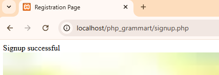
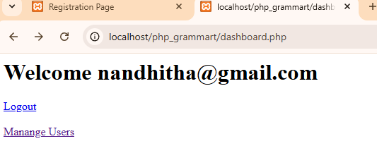
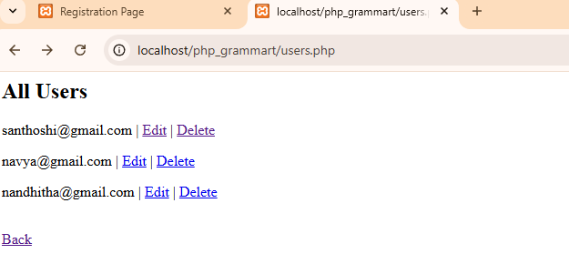
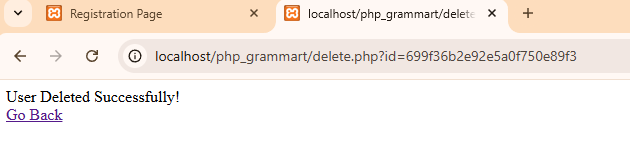
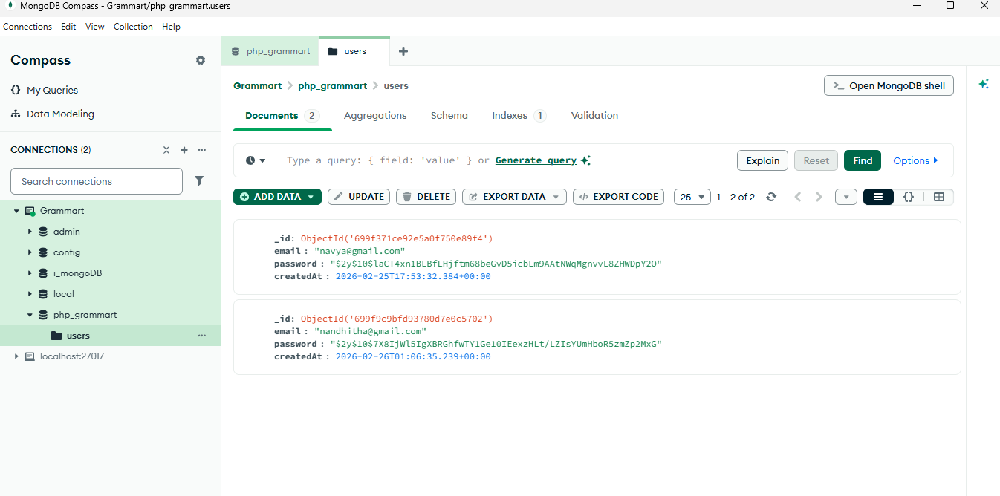

# PHP Grammart Website – MongoDB Integration

## 📌 Project Description

This project integrates MongoDB into the existing PHP Grammart website.  
It implements a complete authentication system with full CRUD operations using MongoDB as the database.

The project demonstrates real-world backend integration skills including validation, error handling, session management, and environment configuration.

---

## 🚀 Features Implemented

- User Signup (Insert document)
- User Login (Read document)
- Session-based Dashboard
- Logout functionality
- View All Users (Read multiple documents)
- Edit User (Update document)
- Delete User (Delete document)
- Duplicate Email Prevention
- Input Validation
- Error Handling with try-catch
- MongoDB Integration using PHP Driver
- Environment Configuration using `.env`

---

## 🛠 Technologies Used

- PHP 8.x
- MongoDB Community Server
- MongoDB PHP Driver
- Composer
- XAMPP (Apache Server)
- MongoDB Compass

---

## 🗄 Database Details

- Database Name: `php_grammart`
- Collection Name: `users`

MongoDB automatically creates the database and collection when first document is inserted.

---

## ⚙️ Setup Instructions

1. Install MongoDB Community Server
2. Start MongoDB Service
3. Install XAMPP and start Apache
4. Enable `php_mongodb` extension in php.ini
5. Install Composer
6. Run:

---

## 🔐 Authentication Flow

1. User signs up → data stored in MongoDB
2. User logs in → credentials verified
3. Session created
4. Dashboard accessible only if logged in
5. Logout destroys session

---

## 📸 Screenshots

### Signup Page

### Login Page

### Dashboard

### Users List

### Edit User

### Delete User

### MongoDB Compass

